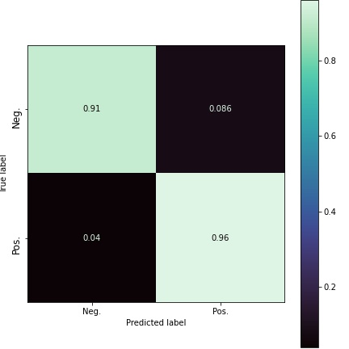

# Sentiment Analysis for Product Reviews

* Using ML algorithms to capture customer's "sentiment" from the text of his/her review.

* To be able to identify both: satisfied and unsatisfied customers

* With relative simplicity of implementation to get maximum accuracy and precision

### WHAT'S IN THE REPOSITORY?

#### notebooks 

* [EDA.ipynb](https://github.com/schahmatist/Amazon_Reviews_Sentiment_Analysys/blob/main/notebooks/EDA.ipynb) - Exploring the Data before cleating a model  
 

* [Preprocessing_Pipe.ipynb](https://github.com/schahmatist/Amazon_Reviews_Sentiment_Analysys/blob/main/notebooks/Preprocessing_Pipe.ipynb) - Pre-processing data as a part of sklearn pipeline  

* [Modeling.ipynb](https://github.com/schahmatist/Amazon_Reviews_Sentiment_Analysys/blob/main/notebooks/Modeling.ipynb) - Modeling - Iterative approach, progress from the first to the best model  
 

* [Load_model_and_data.ipynb](https://github.com/schahmatist/Amazon_Reviews_Sentiment_Analysys/blob/main/notebooks/Load_model_and_data.ipynb) - Optionally, you can load pickled models and data to save time on training

#### src

* [import_libraries.py](https://github.com/schahmatist/Amazon_Reviews_Sentiment_Analysys/blob/main/src/import_functions.py) - importing requred sklearn, nltk, pandas, numpy, and other libraries  
 
* [initial_preprocessing.py](https://github.com/schahmatist/Amazon_Reviews_Sentiment_Analysys/blob/main/src/import_functions.py) - initial loading and very basic pre-proccessing of the data
 
* [import_functions.py](https://github.com/schahmatist/Amazon_Reviews_Sentiment_Analysys/blob/main/src/import_functions.py) - importing custom functions 
 
* [preproc_pipe.py](https://github.com/schahmatist/Amazon_Reviews_Sentiment_Analysys/blob/main/src/import_functions.py) - Building a preproc pipeline with custom classes and functions as described in [Preprocessing_Pipe.ipynb](https://github.com/schahmatist/Amazon_Reviews_Sentiment_Analysys/blob/main/notebooks/Preprocessing_Pipe.ipynb)
 

## HIGH LEVEL PROJECT DETAILS:

### DATA

  

* Food Amazon Reviews from Oct 1999 - Oct 2012
* 568,454 reviews
* 256,059 users
* 74,258 products
* Source: https://www.kaggle.com/datasets/snap/amazon-fine-food-reviews

### DATA PRE-PROCESSING 

* Used 'Text' and 'Summary' for prediction
* removing non-alpha characters
* converted to lowercase
* stemming words
* removed common words
* converted to base/dictionary form for EDA and visualizations

***
### NEW FEATURES

Lots of features were considered for training the model ( including  
use of smiles, dots, and varius punctuation in a review )  

#### The following features were chosen:

* Length of the review
* Capitalization
* Use of punctuation (? and !)
* ngrams (word combinations)
* Words and ngrams frequencies
* Checking for misspelled words
* "Bag of words" method

### ALGORITHMS

Multiple algorithms were considered including MultinomialNB, XGB, Bernoulli, RandomForest  

**The following were chosen for the best model:**

Voting Ensemble of:

* ComplementNB 
* XGB boost

### EVALUATION

* Accuracy of 95.3 was acheived
***
**More detailed evaluation metrics:**

                       precision  recall      f1-score   
             Neg.      0.81       0.91        0.86        
             Pos.      0.98       0.96        0.97      

             Accuracy :                       0.953 

  
